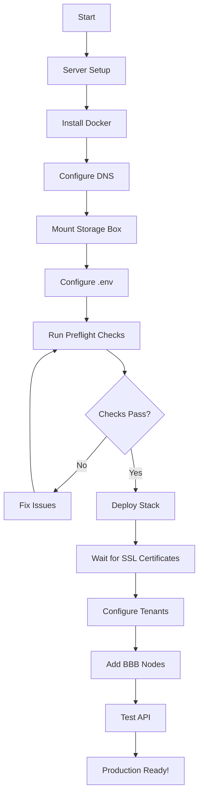

# B3LB Deployment Documentation

**Complete deployment guides for B3LB on Hetzner infrastructure with Traefik**

---

## Quick Start

**For Hetzner EX44 with Traefik deployment:**

1. Read: [HETZNER-VPS-TRAEFIK-DEPLOYMENT.md](./HETZNER-VPS-TRAEFIK-DEPLOYMENT.md)
2. Run: `./scripts/deploy/00-preflight-check.sh`
3. Configure: `.env` file
4. Deploy: `./scripts/deploy/03-deploy-stack.sh`
5. Configure: [INITIAL-CONFIGURATION.md](./INITIAL-CONFIGURATION.md)

**Estimated time**: 1.5-2 hours

---

## Documentation Index

### 📘 Main Guides

| Document | Purpose | Audience |
|----------|---------|----------|
| **[HETZNER-VPS-TRAEFIK-DEPLOYMENT.md](./HETZNER-VPS-TRAEFIK-DEPLOYMENT.md)** | Complete deployment guide for Hetzner EX44 | DevOps, SysAdmins |
| **[INITIAL-CONFIGURATION.md](./INITIAL-CONFIGURATION.md)** | Post-deployment configuration (tenants, nodes, clusters) | Administrators |
| **[BBB-NODE-SETUP.md](./BBB-NODE-SETUP.md)** | Setup scripts on BigBlueButton nodes | BBB Administrators |

### 🔧 Configuration Files

| File | Location | Purpose |
|------|----------|---------|
| **docker-compose.hetzner-production.yml** | `/` | Production Docker Compose stack |
| **.env.hetzner.example** | `/` | Environment configuration template |
| **traefik.yml** | `/traefik/` | Traefik static configuration |
| **middlewares.yml** | `/traefik/dynamic/` | Security & compression middleware |
| **tls.yml** | `/traefik/dynamic/` | TLS/SSL configuration |
| **prometheus.yml** | `/monitoring/prometheus/` | Prometheus scrape config |
| **alerts.yml** | `/monitoring/prometheus/` | Alert rules |

### 🚀 Deployment Scripts

| Script | Purpose | When to Use |
|--------|---------|-------------|
| `mount-storagebox.sh` | Mount Hetzner Storage Box | Before deployment |
| `test-storagebox.sh` | Verify Storage Box connectivity | After mounting |
| `00-preflight-check.sh` | Validate system requirements | Before deployment |
| `03-deploy-stack.sh` | Deploy complete B3LB stack | Main deployment |

---

## Deployment Workflow



---

## Architecture Overview

### Hetzner EX44 Production Stack

```
┌─────────────────────────────────────────────────────────────┐
│                    Internet (Port 80/443)                    │
└────────────────────────┬────────────────────────────────────┘
                         │
                    ┌────▼─────┐
                    │ Traefik  │ ← Let's Encrypt DNS-01
                    │  Proxy   │
                    └────┬─────┘
                         │
        ┌────────────────┼────────────────┐
        │                │                │
   ┌────▼───┐       ┌───▼────┐      ┌───▼────┐
   │Frontend│       │Frontend│      │Frontend│ (3 replicas)
   └────┬───┘       └────┬───┘      └────┬───┘
        │                │                │
        └────────────────┼────────────────┘
                         │
        ┌────────────────┴────────────────┐
        │                                 │
   ┌────▼─────┐                    ┌─────▼────┐
   │PostgreSQL│                    │  Redis   │
   └────┬─────┘                    └─────┬────┘
        │                                 │
        └────────────────┬────────────────┘
                         │
                ┌────────┴─────────┐
                │                  │
           ┌────▼────┐      ┌──────▼─────┐
           │ Celery  │      │  Celery    │
           │  Beat   │      │  Workers   │
           └─────────┘      └──────┬─────┘
                                   │
                            ┌──────▼──────┐
                            │Storage Box  │
                            │   (5 TB)    │
                            └─────────────┘
```

### Service Specifications

| Service | Replicas | Memory | CPU | Role |
|---------|----------|--------|-----|------|
| **Traefik** | 1 | 512MB | 0.5 | Reverse proxy, SSL termination |
| **Frontend** | 3 | 2GB each | 1.0 | B3LB API servers |
| **PostgreSQL** | 1 | 16GB | 4.0 | Primary database |
| **Redis** | 1 | 4GB | 1.0 | Cache & message broker |
| **Celery Beat** | 1 | 512MB | 0.5 | Task scheduler |
| **Celery Core** | 3 | 2GB each | 1.0 | Background tasks |
| **Celery Record** | 2 | 10GB each | 2.0 | Video rendering (PyPy) |
| **Prometheus** | 1 | 2GB | 0.5 | Metrics collection |
| **Grafana** | 1 | 1GB | 0.5 | Dashboards |

**Total Resource Usage**: ~56GB RAM, ~11 CPU cores

---

## Prerequisites Checklist

### Required Services

- [x] **Hetzner Dedicated Server** (EX44 or similar)
  - 14+ CPU cores
  - 64GB RAM
  - 512GB+ SSD storage
  - 1 Gbit/s network

- [x] **Hetzner Storage Box** (5TB)
  - CIFS access enabled
  - Credentials available

- [x] **Hetzner DNS**
  - Domain configured
  - API token generated
  - Wildcard DNS setup

### Software Requirements

- [x] **Ubuntu Server** 22.04 LTS or 24.04 LTS
- [x] **Docker** 20.10+
- [x] **Docker Compose** 2.0+
- [x] **Git**, **curl**, **htpasswd**

### Access Requirements

- [x] SSH root access to server
- [x] Hetzner Robot panel access
- [x] Hetzner DNS Console access
- [x] Storage Box credentials

---

## Configuration Quick Reference

### Environment Variables

**Critical variables in `.env`:**

```bash
# Django
SECRET_KEY="50+ character random string"
TIME_ZONE="Europe/Paris"

# Database
POSTGRES_PASSWORD="strong-password"

# Cache
REDIS_PASSWORD="strong-password"

# SSL/DNS
HETZNER_DNS_API_TOKEN="your-token"

# Monitoring
GRAFANA_ADMIN_PASSWORD="strong-password"

# Storage
STORAGEBOX_HOST="u123456.your-storagebox.de"
STORAGEBOX_USERNAME="u123456"
STORAGEBOX_PASSWORD="your-password"
```

### DNS Records

```dns
A     b3lb.serveur.cc        YOUR_SERVER_IP
A     *.b3lb.serveur.cc      YOUR_SERVER_IP
```

### Firewall Rules

```bash
ufw allow 22/tcp   # SSH
ufw allow 80/tcp   # HTTP (redirects to HTTPS)
ufw allow 443/tcp  # HTTPS
```

---

## Common Tasks

### View Logs

```bash
# All services
docker-compose -f docker-compose.hetzner-production.yml logs -f

# Specific service
docker-compose -f docker-compose.hetzner-production.yml logs -f frontend

# Last 100 lines
docker-compose -f docker-compose.hetzner-production.yml logs --tail=100 traefik
```

### Restart Services

```bash
# Restart all
docker-compose -f docker-compose.hetzner-production.yml restart

# Restart specific service
docker-compose -f docker-compose.hetzner-production.yml restart frontend

# Restart with rebuild
docker-compose -f docker-compose.hetzner-production.yml up -d --force-recreate frontend
```

### Scale Services

```bash
# Scale frontend to 5 replicas
docker-compose -f docker-compose.hetzner-production.yml up -d --scale frontend=5

# Scale celery workers to 5 replicas
docker-compose -f docker-compose.hetzner-production.yml up -d --scale celery-core=5
```

### Access Django Shell

```bash
docker-compose -f docker-compose.hetzner-production.yml exec frontend \
    python manage.py shell
```

### Run Database Migrations

```bash
docker-compose -f docker-compose.hetzner-production.yml exec frontend \
    python manage.py migrate
```

### Create Additional Superuser

```bash
docker-compose -f docker-compose.hetzner-production.yml exec frontend \
    python manage.py createsuperuser
```

---

## Monitoring & Metrics

### Access Points

| Service | URL | Credentials |
|---------|-----|-------------|
| **Grafana** | https://grafana.b3lb.serveur.cc | admin / (from .env) |
| **Prometheus** | https://prometheus.b3lb.serveur.cc | (Traefik auth) |
| **Traefik Dashboard** | https://traefik.b3lb.serveur.cc | (from .env) |
| **Django Admin** | https://b3lb.serveur.cc/admin/ | admin / (set during deploy) |

### Key Metrics

- **b3lb_meetings_total** - Active meetings across all nodes
- **b3lb_attendees_total** - Total concurrent attendees
- **b3lb_node_health** - Health status of each BBB node
- **traefik_http_requests_total** - HTTP request rates
- **postgres_connections** - Database connection pool usage
- **redis_memory_used_bytes** - Redis memory consumption

---

## Troubleshooting Guide

### SSL Certificate Issues

**Symptom**: Certificate not issued after 10 minutes

**Check**:
1. DNS propagation: `dig +short b3lb.serveur.cc`
2. API token valid in `.env`
3. Traefik logs: `docker-compose logs traefik | grep acme`

**Solution**: Wait up to 30 minutes, check Hetzner DNS Console

### Service Won't Start

**Symptom**: Container keeps restarting

**Check**:
1. Logs: `docker-compose logs [service]`
2. Resources: `docker stats`
3. Disk space: `df -h`

**Solution**: Fix configuration, add resources, or clear disk space

### Database Connection Errors

**Symptom**: "could not connect to server"

**Check**:
1. PostgreSQL running: `docker-compose ps postgres`
2. Credentials in `.env`
3. Network: `docker network ls`

**Solution**: Restart postgres, verify `.env`, recreate network

### Storage Box Not Mounted

**Symptom**: `/mnt/b3lb-recordings` not accessible

**Check**:
1. Mount status: `mountpoint /mnt/b3lb-recordings`
2. Credentials: `cat /root/.storagebox-credentials`
3. Network: `ping u123456.your-storagebox.de`

**Solution**: Re-run `./scripts/storage/mount-storagebox.sh`

---

## Maintenance

### Update B3LB

```bash
cd /opt/b3lb
git pull
docker-compose -f docker-compose.hetzner-production.yml pull
docker-compose -f docker-compose.hetzner-production.yml up -d
docker-compose -f docker-compose.hetzner-production.yml exec frontend python manage.py migrate
```

### Backup Database

```bash
./scripts/backup/backup.sh
```

**Backup location**: `/mnt/b3lb-recordings/backups/`

### Update System Packages

```bash
apt update && apt upgrade -y
reboot  # if kernel updated
```

---

## Support & Resources

### Official Documentation

- **B3LB Docs**: https://docs.b3lb.io/
- **Traefik Docs**: https://doc.traefik.io/traefik/
- **Hetzner Docs**: https://docs.hetzner.com/
- **BigBlueButton Docs**: https://docs.bigbluebutton.org/

### Community

- **B3LB GitHub**: https://github.com/DE-IBH/b3lb
- **Issues**: https://github.com/DE-IBH/b3lb/issues
- **Discussions**: https://github.com/DE-IBH/b3lb/discussions

### Professional Support

- **IBH IT-Service GmbH**: https://www.ibh.de/ (B3LB developers)
- **Hetzner Support**: https://www.hetzner.com/support

---

## Version Information

- **Deployment Guide**: v1.0
- **B3LB Version**: 3.3.2
- **Traefik Version**: 3.2
- **PostgreSQL Version**: 16
- **Redis Version**: 7
- **Target Server**: Hetzner EX44
- **Last Updated**: 2025-01-15

---

## Contributing

Found an issue or improvement for these deployment docs?

1. Fork the repository
2. Create a feature branch
3. Make your changes
4. Submit a pull request

---

**Deployment Documentation**
Built with ❤️ for the BigBlueButton community
